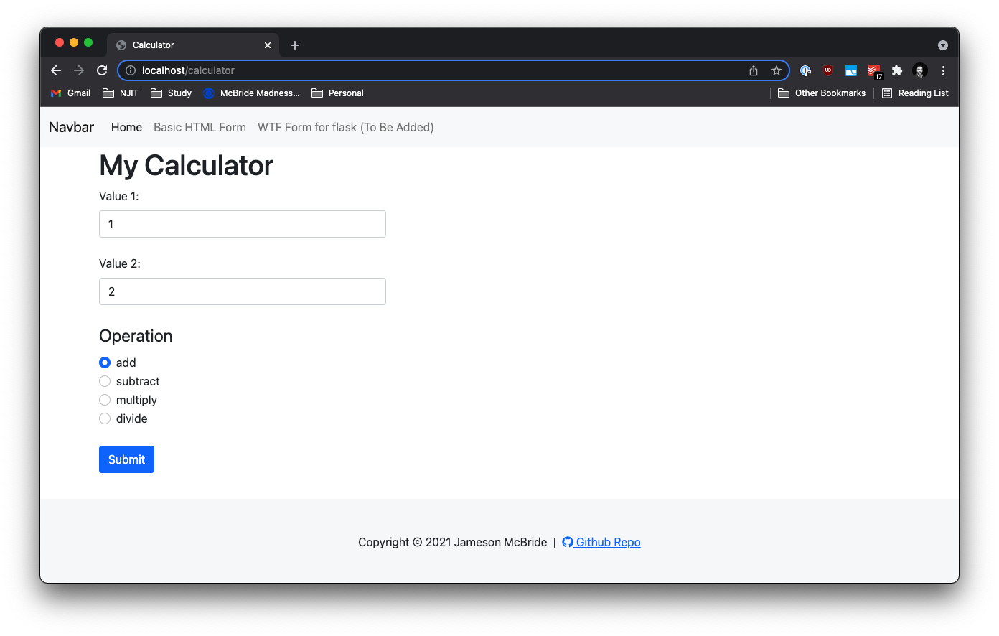
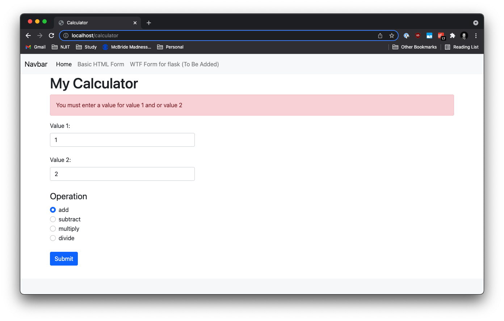
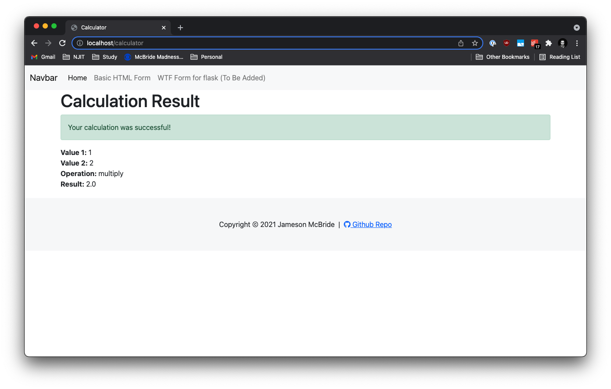

# Calculator Project Setup

Run Pip Install
pip install -r requirements.txt

To run tests, Lint, and Coverage report use this command:

pytest  --pylint --cov

.pylintrc is the config for pylint
.coveragerc is the config for coverage
setup.py is a config file for pytest

## Flash Messages and Validation Assignment
Below are three screenshots showing:
1. Calculator app's form on initial load.
2. Calculator app's error flash messages.
3. Calculator app's success flash messages.

